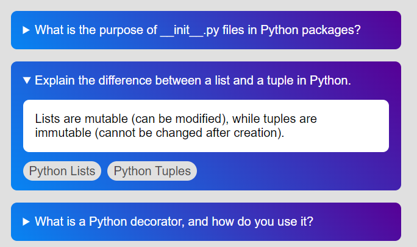
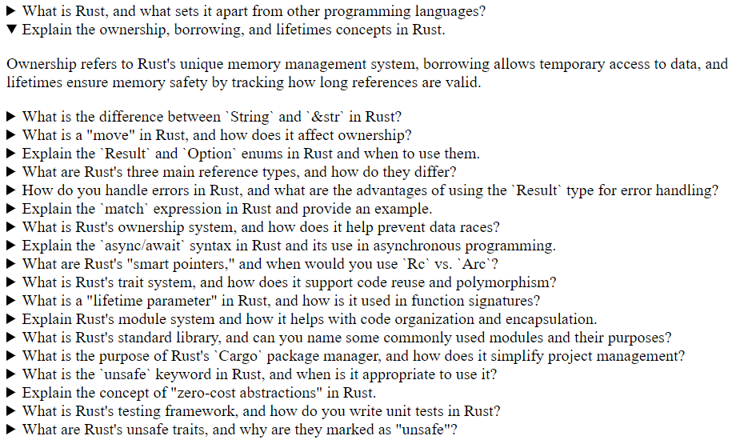
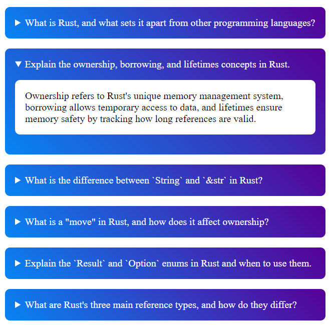

# Using ChatGPT to Generate Flashcards

> :warning: _You should never take ChatGPT's answers as fact. Use your own critical thought and research to confirm what ChatGPT tells you. I like to think of it as an eager research intern whose work you should always check._

## End Result Sneak Peek

Here's a peek at the end result, a set of ChatGPT generated questions and answers with links to documentation for further learning.



[Live Version](https://skylera.github.io/chatgpt-flashcard-generator/)

## Motivation

I wanted to refresh my knowledge of some languages I hadn't used in awhile. Instead of reading all the docs, I thought ChatGPT might do a good job of coming up with some quick topics to review and if you asked it to format it with the [details disclosure element](https://developer.mozilla.org/en-US/docs/Web/HTML/Element/details) you'd have instant flashcards.

## Basic Plan

- Tell ChatGPT it's an expert in your field of interest
- Ask it for question/answer pairs
- Ask it to format the results in a way that helps you study.

## The Barebones Prompt

> `You are a [INSERT LANGUAGE] expert doing tech interviews. Come up with 20 questions and answers that you would use in a typical interview to assess a candidate's experience. Keep your questions and answers to 1 or 2 sentences. Provide your answer in html details/summary form. For example: <details><summary>What are the primary colors?</summary>Red, Blue, and Yellow</details>. Place all the answer in a valid html file`

_This is a basic prompt, but changing the question count, difficulty, and answer length are some variables you might want to experiment with_

## Barebones Result

Now if you aren't picky you've already got an easy to use set of questions/answer you can quiz yourself with.



## Styled Results

Adding just a bit of css can help make it easier to read



```css
<style>
    details {
        border-radius: .5rem;
        background-image: linear-gradient(45deg, #0785f3, #570096);
        padding: 1rem;
        color: white;
        width: 30rem;
        margin: 1rem 0;
    }

    .answer {
        padding: 1rem;
        border-radius: .5rem;
        background-color: white;
        color: black;
    }
</style>
```

## Adding Confidence

Remember the warning at the beginning about never trusting ChatGPT? You can add a link to the docs by updating the prompt with somethign like this:

> `If possible provide a link to the documentation for the topic. Provide your answer in html details/summary form. For example: <details><summary>What are the primary colors?</summary><p class="answer>Red, Blue, and Yellow<p><p class="link"><a href="[link to documentation]">documentation</a></p></details>`

## Mind the GPT Limits

As you add more formatting or increase the question count, you might notice ChatGPT stopping mid answer, just click the continue generating button to get the full output.


## Adding Some Polish

At this point you can tweak and polish this as you see fit.

I decided to convert the results to json so I could save them and then load and generate the flashcards with some javascript.

Here is my final prompt:

> `You are a [INSERT LANGUAGE] expert doing tech interviews. Come up with 20 questions and answers that you would use in a typical interview to assess a candidate's experience. Keep your questions and answers to 1 or 2 sentences. If possible provide a link to the documentation for the topic. Provide your answers in Json format for example: { "question" : "What are the primary colors?", "answer" : "Red, Yellow, and Blue", "links" : [{ "title": [documentation title], "link" : [link to documentation]}] } and combine all those into an array under json key "questions"`

## Finishing up

You can find a very simple final example in [index.html](index.html)
